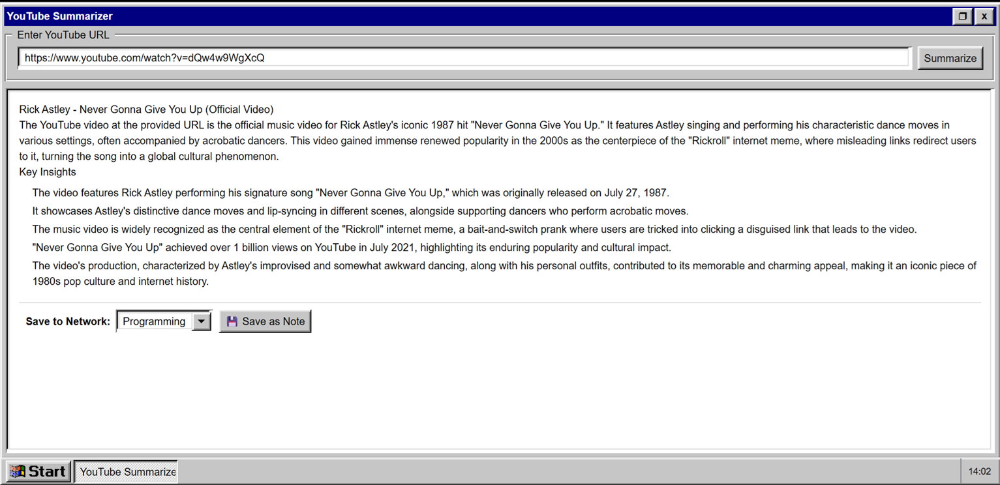
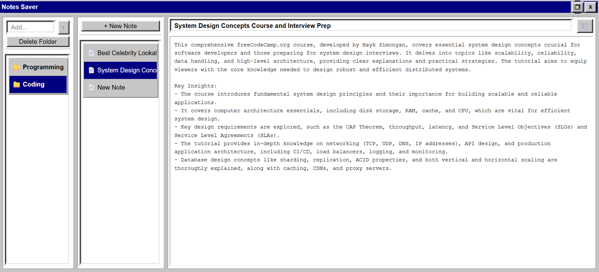

<div align="center">
  
  <h1>Prodigy95 OS</h1>
  <p>A functional, web-based retro desktop environment built with Next.js & React95</p>

  [](https://nextjs.org/)
  [](https://react.dev/)
  [](https://github.com/React95/React95)
  [](#)
  [](https://firebase.google.com/)
</div>

---

## 💾 About The Project

**Prodigy95 OS** is an innovative web application that meticulously recreates the nostalgic aesthetic and functional paradigms of the classic Windows 95 operating system directly within a modern web browser. 

Built on a robust Next.js and React architecture, the project marries retro UI components with contemporary state management and component-driven design. It provides a unique, interactive desktop environment complete with draggable and resizable application windows, a Start Menu, a Taskbar, and dedicated functional applications.

### ✨ Live Preview
> https://prodigy95-os.vercel.app/

*(Add a primary screenshot of the desktop here)*


---

## 🚀 Key Features

### 🪟 Robust Window Management
Develop a reliable system for opening, maximizing, minimizing, dragging, resizing, and focusing multiple overlapping application windows concurrently using `react-rnd` and `Zustand`.

### 🛠️ Integrated Applications
The OS comes pre-loaded with fully functional applications integrated within the ecosystem:
- **📝 Notes Saver:** A comprehensive hierarchical notes app capable of managing folders and individual note contents, synced with Firebase.
- **📹 YouTube Summarizer:** Paste a YouTube link and get rapid AI-driven insights from video transcripts using Gemini/Groq APIs.
- **💼 AI Job Search:** Retrieves data from remote boards to present employment opportunities using Firecrawl.
- **💣 Minesweeper:** The classic retro game, fully playable and integrated into the desktop ecosystem.
- **🧠 Prodigy AI:** Direct interaction with AI models right from your retro desktop.
- **🔑 Network Login:** Secure authentication gateway powered by Firebase Google Auth.

*(Add screenshots of the applications in action here)*
<div align="center">
  
  
</div>

---

## 🛠️ Built With (Tech Stack)

The project relies on a carefully selected stack of modern web technologies to handle both the aesthetic and complex functional requirements:

- **Framework:** [Next.js v16](https://nextjs.org/) (App Router)
- **UI Library:** [React v19](https://react.dev/)
- **State Management:** [Zustand](https://zustand-demo.pmnd.rs/) (Fast, scalable bearbones state-management)
- **Retro Design System:** [React95](https://react95.io/) & [Styled-Components](https://styled-components.com/)
- **Window Management:** [React-RND](https://github.com/bokuweb/react-rnd) (Resizable and draggable windows)
- **Backend & Auth:** [Firebase](https://firebase.google.com/)
- **AI Integrations:** Google Gemini API, Groq SDK, Firecrawl JS

---

## ⚙️ Getting Started (Make It Your Own)

To get a local copy up and running, follow these simple steps.

### Prerequisites
- Node.js (v20 or higher recommended)
- npm, yarn, pnpm, or bun

### 1. Clone the repository
```bash
git clone https://github.com/yourusername/prodigy95os.git
cd prodigy95os
```

### 2. Install Dependencies
```bash
npm install
# or yarn install
```

### 3. Environment Variables
Create a `.env.local` file in the root directory and add the required API keys. You will need Firebase credentials and AI API keys to use all applications.

```env
# Firebase Configuration
NEXT_PUBLIC_FIREBASE_API_KEY="your-api-key"
NEXT_PUBLIC_FIREBASE_AUTH_DOMAIN="your-project.firebaseapp.com"
NEXT_PUBLIC_FIREBASE_PROJECT_ID="your-project-id"
NEXT_PUBLIC_FIREBASE_STORAGE_BUCKET="your-project.appspot.com"
NEXT_PUBLIC_FIREBASE_MESSAGING_SENDER_ID="your-sender-id"
NEXT_PUBLIC_FIREBASE_APP_ID="your-app-id"

# AI & Scraping
GEMINI_API_KEY="your-gemini-key"
FIRECRAWL_API_KEY="your-firecrawl-key"
```
*(Reference `REQUIRED_API_KEYS.md` for more details on acquiring these keys).*

### 4. Run the Development Server
```bash
npm run dev
```

Open [http://localhost:3000](http://localhost:3000) with your browser to see the OS in action!

---

## 🔮 Future Enhancements
The architecture is designed to be highly extensible. Future possibilities include:
- **Cloud Storage:** Hooking the existing `useDesktopStore` into Firebase to save user layouts, open windows, and theme preferences across devices.
- **File Explorer:** An app that navigates a mock directory structure or a user's cloud-stored files.
- **Personalization:** Changing desktop backgrounds, theme color tweaks, and screensavers.

---

## 📄 License
Distributed under the MIT License. See `LICENSE` for more information.

---
<div align="center">
  <sub>Built with nostalgia by <a href="https://github.com/CyberScythe1">Prithvi Raj K.N.</a></sub>
</div>
